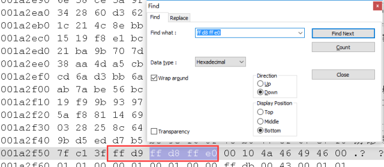

# 找寻微信撤回的图片

张洋 [Yang的后花园](javascript:void(0);) *2016-06-19 12:50*

## 1 消失的“艳”图

自从微信添加撤回消息功能后，我的好奇心翻了好几番啊！

我们身边有一个逗比，暂且称他为胖胖，经常在朋友圈和微信群里说单口相声，内容以自黑为主，配图恰到好处。他乐观、奉献的精神深深的打动了我们。

前不久他在微信群里放出了一张聊天截图，肯定有料，但奈何他迅速撤回了。然后他在发送和撤回之间迭代，大家的好奇心被撩的不要不要的。最终通过其他渠道终于看到了那张图，治好了我的毕业综合症，心情美丽了好几天。

最近还发生了一起“消息撤回事件”，主人公爱生活，有梦想。具体来说是，力争把生活存成JPEG。对，无处不拍照，无景也能high！他丢过来一张“艳”图，当我准备鸡蛋里挑骨头的时候，他撤回了！心情是这样纸滴：`rm -rf /*`。

## 2 真相只有一个

微信的消息撤回功能算是治疗输入法不够智能的一剂良药，但是却毁了生活中的一些小乐子啊。作为一名程序员，我忍无可忍了，柯南附体，必须找到那张消失的“艳”图。之前有听说Xposed框架里的防止微信撤回插件，更加坚定了我的信心。

因为当时刚好PC和手机同时登陆了微信，所以先从PC这里入手。

### 2.1 PC端

经过一番调研，把储存的位置锁定到了`[X]:\Users\[USER]\Documents\WeChat Files\[WECHAT_USER]\Data`。里面有一堆以`.dat`为后缀的文件，他们大小不一，其中最新的一个文件100多KB，我猜这应该就是要找的图片。

于是把后缀改为`.jpg`试试看，结果失败。果断给Notepad++装上HEX-Editor插件，秒变UltroEdit啊！为了找到图片的加密方法，随便找了一张图，发送过来，并到微信储存图片的位置找到最新的`.dat`文件，Notepad++打开是这样的（加密后的图片）：


在微信的客户端里右键另存为，把图片储存到本地，Notepad++打开是这样的（原始图片)：


可以很明显的看到，原始图片的`63 63 ...`变成了`32 32 ...`。猜测图片中的每一个字节经都经过了变换。为了方便寻找规律，找到原始图片的`00`，其对应加密后的图片的`51`，于是大胆猜测变换的方法是：`

```
def encode(b):
    return b + 0x51
```

但是，`0x63 + 0x51`并不等于`0x32`。把16进制换成2进制再看一下：

```
   0110 0011
?  0101 0001
--------------
   0011 0010
```

当两个1相加的时候并没有进位，所以这不是加法，而是半加，即异或！赶紧写代码试验一下：

```
def _decode_pc_dat(self, datfile):
    magic = 0x51

    with open(datfile, 'rb') as f:
        buf = bytearray(f.read())

    imgfile = re.sub(r'.dat$', '.jpg', datfile)     with open(imgfile, 'wb') as f:
        newbuf = bytearray(map(lambda b: b ^ magic, list(buf)))
        f.write(str(newbuf))
```

成功找到“艳”图。

### 2.2 手机端（Android）

通过对微信路径里的文件逐一排查，最终找到了可疑的文件：`/sdcard/tencent/MicroMsg/diskcache`。该路径里的文件名称类似`cache.data.10`，大小在2MB左右。如果把后缀改为`.jpg`，是可以打开的。但是，疑点在于，2MB的图片，竟然马赛克浓度这么高，这充其量也就是才10几KB吧。而且，每一个文件都是2MB左右，人工的痕迹很明显啊。

能够打开图片，说明文件的内容是没有做任何修改的，文件头、文件尾都是非常正规的。难道，微信的工程师把多个图片串联了起来？！像这样：

```
图片1的头部
图片1的尾部
图片2的头部
图片2的尾部
...
```

因为JPEG的文件是以`ff d8 ff e0`开始的，以`ff d9`结束，搜索一下：


在一个图片的二进制中搜索到了多个文件头，且文件头的前面是一个文件尾标识，与猜测吻合。至此，可以写出解密方法了：

```
def _decode_android_dat(self, datfile):
    with open(datfile, 'rb') as f:
        buf = f.read()

    last_index = 0
    for i, m in enumerate(re.finditer(b'\xff\xd8\xff\xe0\x00\x10\x4a\x46', buf)):        if m.start() == 0:            continue

        imgfile = '%s_%d.jpg' % (datfile, i)        with open(imgfile, 'wb') as f:
            f.write(buf[last_index: m.start()])
        last_index = m.start()
```

## 3 神奇的0x51

对于PC端图片的加密，工程师选择了一个神奇的数字`0x51`与各个字节进行异或。为什么要选择`0x51`呢？

```
>>> chr(0x51)
'Q'
```

`0x51`对应的ASCII码为“QQ”的Q！

最后献上微信图片解密、找回撤回的图片工具： https://github.com/zhangxiaoyang/WechatImageDecoder。


## 参考

- http://image.kejixun.com/2015/0504/20150504034225444.jpg
- http://www.repo.xposed.info/
- https://www.zhihu.com/question/35056157
- https://github.com/zhangxiaoyang/WechatImageDecoder

------

# 找寻微信撤回的图片（续）


## 1 前情回顾

自从发布文章“找寻微信撤回的图片”之后，骗了不少粉啊。如果你还没有阅读，请关注微信公众号 或者 知乎专栏：Yang的后花园 查看。

VIP快速通道：

- 微信文章地址：

  http://mp.weixin.qq.com/s?__biz=MzIzNDM0OTM5NA==&mid=2247483711&idx=1&sn=83c60e80ccd80d36e33c0950eba41680&scene=0#rd

- 知乎文章地址：

  https://zhuanlan.zhihu.com/p/21388706

总之，之前提出了一种可以找到微信撤回图片的方法。而这篇文章属于“打脸篇”，之前的方法有些许纰漏，在此更正。

## 2 看不清的真相

之前的说法是，微信的工程师并没有真正把撤回的图片删除，而是加密后藏起来了。其实这样说并不严谨，经过后续测试，发现PC端的确如此，而手机端（Android）撤回的图片是有删除的，但是删除的不干净。

### 2.1 PC端

微信所有接收到的图片都储在`[X]:\Users\[USER]\Documents\WeChat Files\[WECHAT_USER]\Data`。里面有一堆以`.dat`为后缀的文件，他们大小不一，都经过了加密。而加密的方法便是对字节逐一“异或”。

之前的说法是，加密后的字节 = 原始字节 ^ 0x51。为了方便，我们把0x51称作“magic码”。

有网友反馈，magic码不一定是0x51，有的机器是0x50。经过一些测试，结论是，magic码与微信号有关，即不同的微信号在同一台机器可能得到不同的magic码，而同一个微信号在不同的机器上得到了相同的magic码。这里猜测，magic码是由微信号或者微信ID计算得来的。

其实，我们无需关心magic码的计算方式。因为，我们可以肯定的是，`.dat`文件是图片，而对于JPEG的图片，其对应二进制的第一个字节是`0xFF`。

所以，问题变成了，已知：`.dat`文件对应二进制的第一个字节 ^ magic码 = 0xFF，求magic码。

我们已经知道，如果A^B=C，则(A^A)^B=A^C，而A^A=0，所以B=A^C。

所以，magic码 = 已知`.dat`文件对应二进制的第一个字节 ^ 0xFF。

修改后的解密代码：

```
def _decode_pc_dat(self, datfile):
    with open(datfile, 'rb') as f:
        buf = bytearray(f.read())

    magic = 0xff ^ list(buf)[0] if buf else 0x00 #important
    imgfile = re.sub(r'.dat$', '.jpg', datfile)    with open(imgfile, 'wb') as f:
        newbuf = bytearray(map(lambda b: b ^ magic, list(buf)))
        f.write(str(newbuf))
```

### 2.2 手机端（Android）

之前提到，`/sdcard/tencent/MicroMsg/diskcache`中存放类似`cache.data.10`的文件，大小在2MB左右。如果把文件后缀改为`.jpg`，是可以打开的，JPEG文件里实际上是“串联”了一堆图片，可以通过以下代码把所有的图片拆分出来：

```
def _decode_android_dat(self, datfile):
    with open(datfile, 'rb') as f:
        buf = f.read()

    last_index = 0
    for i, m in enumerate(re.finditer(b'\xff\xd8\xff\xe0\x00\x10\x4a\x46', buf)):        if m.start() == 0:            continue

        imgfile = '%s_%d.jpg' % (datfile, i)        with open(imgfile, 'wb') as f:
            f.write(buf[last_index: m.start()])
        last_index = m.start()
```

通过实验，发现这些拆分出来的图片并不包含撤回的图片。坏消息是，在手机端没有找到撤回的图片。好消息是，在微信的缓存文件夹里找到了撤回图片的“缩略图”。肯定是没有大图好看啦，但是如果我们早些年看过一种3GP格式的视频的话，这些缩略图的品质还是可以接受的。至少能知道对方发的是啥。

路径为：`/sdcard/tencent/MicroMsg/[USER_HASH]/image2/[HASH1]/[HASH2]/th_[HASH]`，比如这样：`/sdcard/tencent/MicroMsg/202cb962ac59075b964b07152d234b70/image2/6b/3a/th_c4ca4238a0b923820dcc509a6f75849b`。给文件名加上`.jpg`后缀就可以打开啦。

由于缓存文件夹里的文件非常多，建议根据修改时间来定位HASH1和HASH2。

## 3 并不神奇的0x51

之前说的最大的一个bug是，对于PC端图片的加密，工程师选择了一个神奇的数字`0x51`与各个字节进行异或。而且我还自圆其说了，说什么0x51是“Q”的ASCII码。为啥选择“Q”呢，因为“QQ”。

不忍直视啊，上面已经解释了，magic码并不固定。最后献上修改后的微信图片解密、找回撤回的图片工具： https://github.com/zhangxiaoyang/WechatImageDecoder。PS：目前工具已经兼容Python3。


------

# 找寻微信撤回的图片（再续）

原创 张洋 [Yang的后花园](javascript:void(0);) *2018-05-18 22:23*

## 引子

根据@icaca的反馈，WID无法解密PNG、GIF图片，现已支持。

上两篇文章有提到，解密的关键在于寻找magic码。通过magic码与加密的图片异或，即可实现解密。

magic码并不固定，微信的朋友说了算。不过不要紧，只要做一个简单的假设，即可获得magic码。

## 原始思路

假设：所有的图片都是JPEG格式。

则：magic码 异或 文件头的第一个字节 = JPEG文件头的第一个字节（0xFF）。

这个思路正是WID的核心解密逻辑，可以解密绝大部分图片。问题也很显然，无法解密其他格式的图片。

## 支持PNG等格式

加密后的图片命名为`*.dat`，我们无法得知这是哪一种格式。最简单粗暴的思路是——猜。

怎么猜？

常见的图片格式都试一下，然后看是否能够打开？

这里取图片的头两个字节，使用首字节计算magic码，然后基于得到的magic解密第二个字节看能否命中JPEG、PNG、GIF等图片文件头的第二个字节。

如果命中，则猜测成功。

```
def do_magic(header_code, buf):
    return header_code ^ list(buf)[0] if buf else 0x00

def decode(magic, buf):
    return bytearray([b ^ magic for b in list(buf)])

def guess_encoding(buf):
    headers = {
        'jpg': (0xff, 0xd8),
        'png': (0x89, 0x50),
        'gif': (0x47, 0x49),
    }
    for encoding in headers:
        header_code, check_code = headers[encoding] 
        magic = do_magic(header_code, buf)
        _, code = decode(magic, buf[:2])
        if check_code == code:
            return (encoding, magic)
    print('Decode failed')
    sys.exit(1)
```

## 参考

- https://en.wikipedia.org/wiki/Magic_number_(programming)#Magic_numbers_in_files
- https://github.com/zhangxiaoyang/WechatImageDecoder


